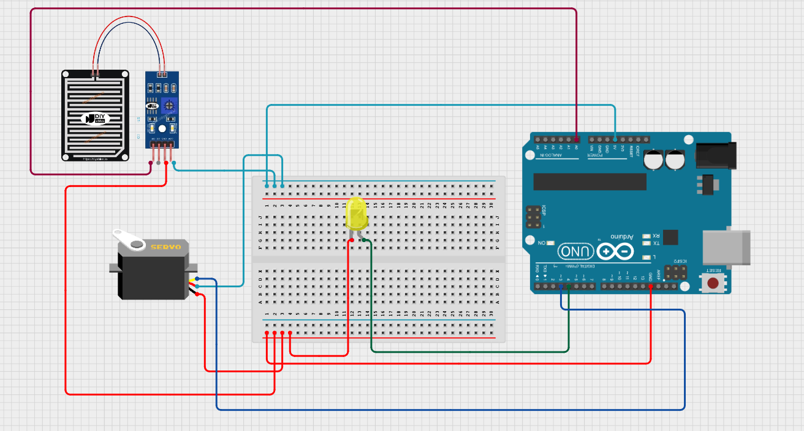
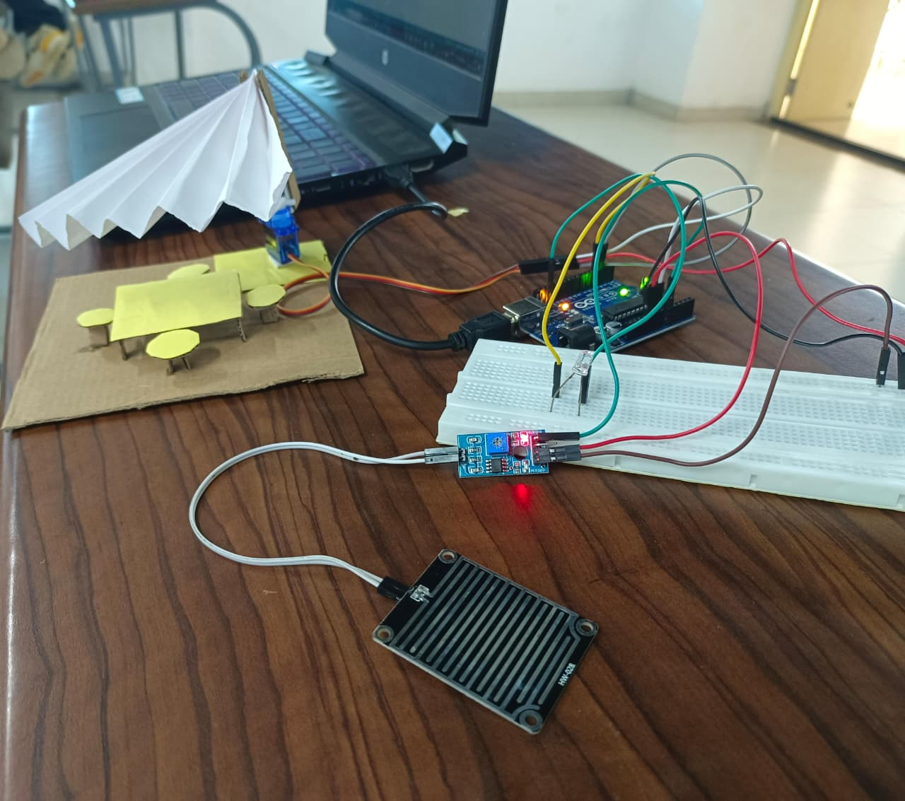

# Smart Umbrella

## Abstract
The Smart Umbrella project provides an automatic shelter solution that deploys an umbrella upon detecting rain. Using an Arduino Uno R3, a rain sensor, servo motor, and optional geared motor, the umbrella opens automatically when rain is detected, offering immediate protection. An LED indicates rain detection, and a web interface allows real-time monitoring of the umbrella status. This combination of hardware and software ensures practical, automated protection in outdoor environments.

**Keywords:** Automatic Shelter, Rain Detection, Arduino, Servo Motor, LED Indicator, Real-Time Monitoring, Node.js, Web Interface

---

## Hardware Components
All hardware components used for the project are listed in [here](hardware/components.md).  

### Key Components
- **Arduino Uno R3**
- **Rain Sensor** 
- **Servo Motor**  
- **LED Indicator** 

---

## Circuit Diagram

---

### Libraries
Required libraries and instructions are listed in [`arduino-code/libraries.md`](arduino-code/libraries.md).

---

## Software Components
The web interface allows real-time monitoring of rain detection and umbrella status. Key components include:

- **Node.js backend** (`software/app.js`) handles real-time updates and communication with Arduino.  
- **HTML frontend** (`software/index.html`) displays the current umbrella state and rain detection status.  
- The backend communicates with Arduino via serial communication to fetch live sensor data.

---

### Hardware Setup & Usage 

<table>
<tr>

<td width="50%" valign="top">

**Usage Instructions:**

1. Assemble the hardware as shown in the image above, ensuring all connections are secure.  
2. Connect the Arduino to your computer via USB.  
3. Open the Arduino IDE, load `arduino-code/smart_cities_umbrella_shed.ino`, and upload it to the Arduino.  
4. Observe the LED; it will turn ON when rain is detected.  
5. The servo motor rotates the umbrella arm between 0° (closed) and 180° (open) automatically based on rain detection.  
6. Start the Node.js server by navigating to the `software` folder and running the server script (`node app.js`).  
7. Open `index.html` in a web browser to view the umbrella status and rain detection in real-time.  
8. Ensure both the Arduino and Node.js server are running simultaneously for seamless operation.  
9. Monitor the console or web interface for real-time status updates and any error messages.  
10. Regularly inspect the mechanical setup and wiring to ensure smooth movement of the servo and safe operation of all components.  

</td>
<td width="50%" valign="middle" align="center">

</td>

</tr>
</table>
